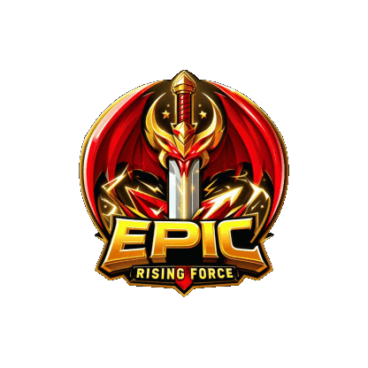

<!DOCTYPE html>
<html lang="en">
<head>
    <meta charset="UTF-8">
    <meta name="viewport" content="width=device-width, initial-scale=1.0">
    <title>Stephen S</title>
    <link rel="stylesheet" href="https://cdnjs.cloudflare.com/ajax/libs/font-awesome/5.15.4/css/all.min.css" integrity="sha512-MY95wDmZbULsGh7unYMj0hIYbZiMjeaM5K7Al5NSP2YjKpN/3/7q3kZ5nAwEMb+1fy0N+XGK/XUawVvOV0Zqew==" crossorigin="anonymous" referrerpolicy="no-referrer" />
    
</head>
<body>
    

        
        <h2>Stephen S</h2>
        
Game Streamer

        

            <i class="fas fa-circle"></i>
            RF EPIC OFFICIAL STREAMER
        

        <nav>
            <ul class="online-menu">
                <li class="active"><a href="#">Home</a></li>
                <li><a href="https://www.instagram.com/stephen.sin8/">Instagram</a></li>
                <li><a href="https://www.youtube.com/@stephen.s8">Youtube</a></li>
                <li><a href="https://www.tiktok.com/@stephen.sin8">Tiktok</a></li>
		

 ---Support Me--- 

                <li><a href="https://saweria.co/StephenSin">Saweria</a></li>
            </ul>
        </nav>
        

            <a href="https://www.instagram.com/stephen.sin8/" target="_blank"><i class="fab fa-instagram"></i></a>
            <a href="https://www.youtube.com/@stephen.s8" target="_blank"><i class="fab fa-youtube"></i></a>
            <a href="C:\Users\User\Desktop\My_Pages\tiktok.png" target="_blank"><i class="fab fa-tiktok"></i></a>
        

    

    

        

            
            <h3>RF EPIC</h3>
            
Embark on an epic adventure in RF EPIC, a new version of the classic MMORPG RF Online.

            <a href="https://www.epicfullpvp.com" target="_blank">Join Now</a>
        

    

    <footer class="footer">
        &copy; 2024 Stephen S. All rights reserved.
    </footer>
</body>
</html>
